# 🔐 Roles & Responsibilities ERD Diagram

## Entity Relationship Diagram (ERD)

This document provides a comprehensive ERD showing the roles, permissions, and relationships in the Internet Billing System.

---

## 📊 Database Schema ERD

---

## 🏗️ Role Hierarchy & Access Control

```mermaid
graph TD
    SA[Super Admin<br/>👑 System Owner] -->|Full Access| ALL[All ISPs & Data]
    
    SA -->|Creates & Manages| ISP1[ISP 1]
    SA -->|Creates & Manages| ISP2[ISP 2]
    SA -->|Creates & Manages| ISP3[ISP N...]
    
    ISP1 -->|Has| ADMIN1[Admin/ISP Owner<br/>🏢 Business Admin]
    ISP2 -->|Has| ADMIN2[Admin/ISP Owner<br/>🏢 Business Admin]
    
    ADMIN1 -->|Manages| STAFF1[Staff Roles]
    ADMIN2 -->|Manages| STAFF2[Staff Roles]
    
    STAFF1 -->|Includes| AM1[Account Manager<br/>💰 Billing]
    STAFF1 -->|Includes| TO1[Technical Officer<br/>🔧 Installations]
    STAFF1 -->|Includes| RO1[Recovery Officer<br/>💵 Collections]
    
    ISP1 -->|Has| CUST1[Customers<br/>👤 End Users]
    ISP2 -->|Has| CUST2[Customers<br/>👤 End Users]
    
    CUST1 -->|Can Access| PORTAL1[Customer Portal<br/>📱 Self-Service]
    CUST2 -->|Can Access| PORTAL2[Customer Portal<br/>📱 Self-Service]
    
    style SA fill:#ff6b6b,stroke:#c92a2a,stroke-width:3px,color:#fff
    style ADMIN1 fill:#4dabf7,stroke:#1971c2,stroke-width:2px,color:#fff
    style ADMIN2 fill:#4dabf7,stroke:#1971c2,stroke-width:2px,color:#fff
    style AM1 fill:#51cf66,stroke:#2f9e44,stroke-width:2px,color:#fff
    style TO1 fill:#ffd43b,stroke:#f59f00,stroke-width:2px,color:#000
    style RO1 fill:#ff922b,stroke:#d9480f,stroke-width:2px,color:#fff
    style CUST1 fill:#ae3ec9,stroke:#862e9c,stroke-width:2px,color:#fff
    style CUST2 fill:#ae3ec9,stroke:#862e9c,stroke-width:2px,color:#fff
```

---

## 🔐 Permission Flow Diagram

---

## 📋 Role-Permission Matrix

---

## 🔄 Data Access Flow

---

## 📊 Role Responsibilities Summary Table

| Role | Level | Primary Responsibility | Data Access | Can Create Users | Can Manage ISPs |
|------|-------|----------------------|-------------|------------------|-----------------|
| **Super Admin** | 1 | Platform owner, manages all ISPs | All ISPs | ✅ All roles | ✅ Yes |
| **Admin (ISP Owner)** | 2 | Business owner, manages ISP operations | Own ISP only | ✅ Staff & Customer | ❌ No |
| **Account Manager** | 3 | Billing & customer accounts | Own ISP only | ❌ No | ❌ No |
| **Technical Officer** | 3 | Installations & technical services | Own ISP only | ❌ No | ❌ No |
| **Recovery Officer** | 3 | Payment collection & recovery | Own ISP only | ❌ No | ❌ No |
| **Customer** | 4 | Self-service portal access | Own data only | ❌ No | ❌ No |

---

## 🎯 Key Relationships

### 1. User → ISP Relationship
- **Super Admin**: `isp_id = NULL` (can access all ISPs)
- **All Other Roles**: `isp_id = <ISP_ID>` (restricted to one ISP)
- **Multi-tenant Isolation**: All queries filtered by `isp_id` except Super Admin

### 2. Role → Permission Relationship
- **Many-to-Many**: One role can have many permissions, one permission can belong to many roles
- **Junction Table**: `role_permissions` links roles and permissions
- **System Roles**: Cannot be deleted (`is_system_role = true`)

### 3. Role → Business Relationship
- **System Roles**: `business_id = NULL` (available to all ISPs)
- **Business Roles**: `business_id = <ISP_ID>` (custom roles for specific ISP)
- **Super Admin Role**: Always system-wide

### 4. Permission Structure
- **Resource**: The entity being accessed (bills, payments, customers, etc.)
- **Action**: The operation (create, read, update, delete, generate, approve, etc.)
- **Granular Control**: Each permission is specific to resource + action

---

## 🔒 Security Constraints

1. **Super Admin Exception**: Bypasses all tenant filters
2. **ISP Isolation**: All non-Super Admin users filtered by `isp_id`
3. **Customer Isolation**: Customers can only access their own data
4. **Role Creation**: Only Super Admin can create Super Admin or Admin roles
5. **System Role Protection**: System roles cannot be deleted
6. **Permission Inheritance**: Higher roles inherit permissions of lower roles

---

## 📝 Notes

- **Dynamic RBAC**: Roles and permissions can be managed through the UI (Super Admin)
- **Tenant Middleware**: Automatically applies ISP filtering to all queries
- **Activity Logging**: All actions are logged with user ID, role, and timestamp
- **JWT Authentication**: All routes require valid JWT token
- **Role Middleware**: Routes are protected by role-based middleware
- **Permission Middleware**: Granular access control using permission checks

---

**Last Updated**: Based on current codebase structure  
**Version**: 1.0

